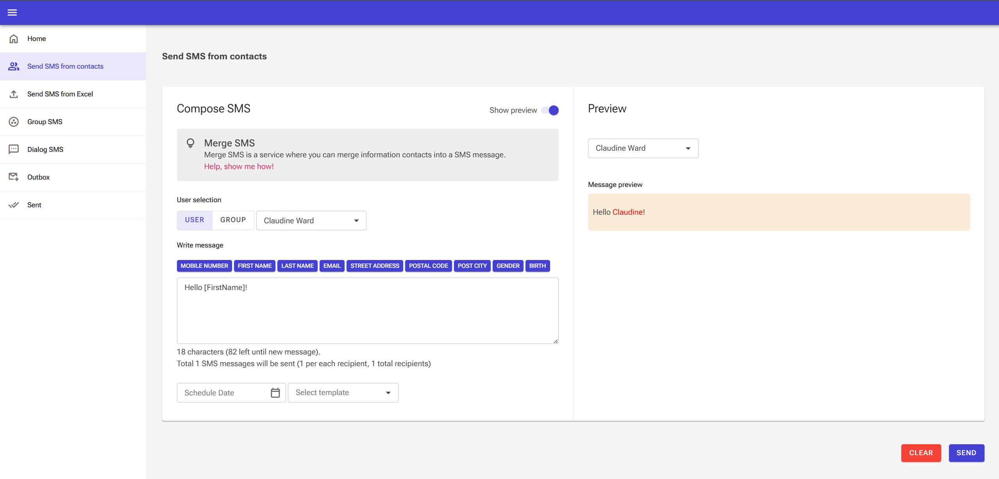

# SMS Sender Interface Redesign

Notes can be found at [NOTES.md](NOTES.md)

## 📲 SMS Sender Interface (Blazor)

A Blazor WebAssembly application for sending personalized and parameterized SMS messages to selected users or user groups. Users can compose messages from scratch or use predefined templates, and simulate scheduled sending for a future date.

⚠️ Note: This is a frontend-only application — SMS delivery and scheduling are simulated for demonstration purposes only.

## ✨ Features

🧑‍🤝‍🧑 User & Group Selection  
Select individual users or groups from a predefined list.

## 📝 Message Personalization

Use dynamic parameters like {FirstName}, {Email}, etc., to tailor messages to each recipient.

## 📦 Predefined Templates

Choose from built-in templates (e.g., greetings, alerts, reminders) or create your own.

## ⏰ Scheduled Sending (Simulated)

Pick a future date and time to simulate scheduling the message.

## 👁️ Live Preview

Instantly preview how each personalized message will look for the selected users.

## 🚀 Getting Started

Prerequisites
.NET 9 SDK

A modern browser (Chrome, Edge, Firefox)

### Run the App

1. Clone the repository:  
   `git clone git clone https://github.com/bgilja/sms-sending-interface-redesign.git`

2. Navigate to project directory:  
   `cd sms-sending-interface-redesign/SmsSendingInterfaceRedesign/SmsSendingInterfaceRedesign`

3. Run the app:  
   `dotnet run --project SmsSendingInterfaceRedesign`

Open your browser and navigate to:
https://localhost:7147 (or as shown in the terminal output)

## 🧪 Demo

[Google Drive](https://drive.google.com/file/d/1Br6uUVT1rdep-iFOUTCNVsIRQUWngw5o/view?usp=drive_link)
